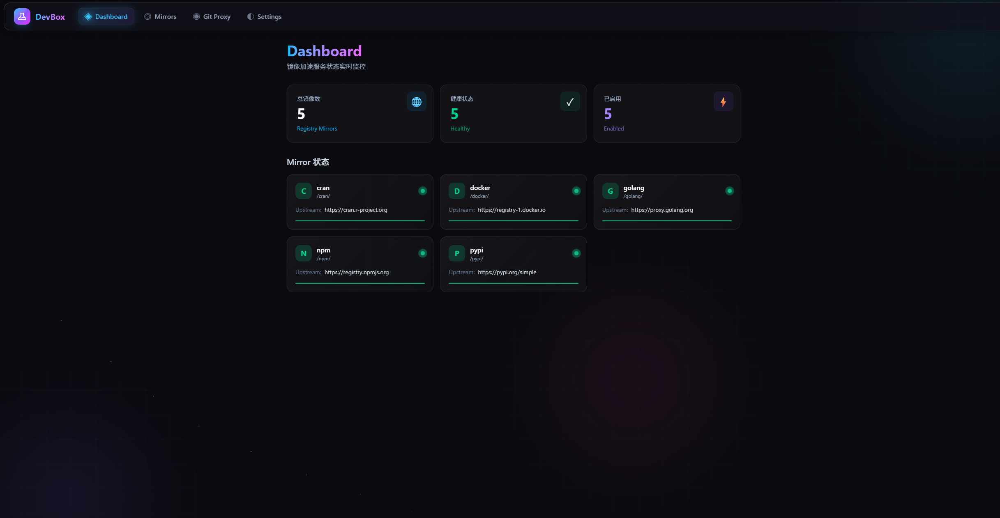

# DevBox - 自部署开发者工具箱

国内开发者自部署在 VPS 上的 Docker 容器工具，解决包管理器镜像加速和 GitHub clone 慢的核心痛点。



## 功能

| 功能 | 说明 |
|------|------|
| npm 镜像 | 代理 `https://registry.npmjs.org` |
| pip 镜像 | 代理 `https://pypi.org/simple` |
| Docker 镜像 | 代理 `https://registry-1.docker.io` |
| Go 模块镜像 | 代理 `https://proxy.golang.org` |
| CRAN 镜像 | 代理 `https://cran.r-project.org` |
| Git Clone 加速 | 代理 GitHub / GitLab 的 clone、archive、raw 请求 |
| Web Dashboard | 状态总览、流量统计、配置管理 |

## 快速部署

```bash
docker run -d \
  --name devbox \
  -p 8080:8080 \
  -v devbox-data:/data \
  ghcr.io/ksbbs/devbox:latest
```

打开浏览器访问 `http://<你的VPS>:8080` 即可看到 Dashboard。

## 配置

默认配置文件路径 `/etc/devbox/default.yaml`，可通过参数 `-c` 指定：

```bash
docker run -d -p 8080:8080 -v devbox-data:/data \
  devbox:latest -c /data/devbox.yaml
```

配置示例：

```yaml
server:
  port: 8080
  auth_token: ""                # Dashboard 鉴权 token，空则不鉴权
  public_url: ""                # 公网访问地址，如 https://dev.example.com

mirrors:
  npm:
    enabled: true
    upstream: "https://registry.npmjs.org"
    cache_ttl: "7d"
  pypi:
    enabled: true
    upstream: "https://pypi.org/simple"
    cache_ttl: "30d"
  docker:
    enabled: true
    upstream: "https://registry-1.docker.io"
    cache_ttl: "0"              # 0 = 永不过期
  golang:
    enabled: true
    upstream: "https://proxy.golang.org"
    cache_ttl: "0"
  cran:
    enabled: true
    upstream: "https://cran.r-project.org"
    cache_ttl: "30d"

gitproxy:
  enabled: true
  github_upstream: "https://github.com"
  gitlab_upstream: "https://gitlab.com"
  cache_ttl: "7d"

cache:
  dir: "/data/cache"
  max_size: "5GB"

logging:
  level: "info"
  access_log: true
```

### 环境变量覆盖

所有配置项都可通过环境变量覆盖，格式 `DEVBOX_<层级>_<键>`：

```bash
DEVBOX_SERVER_PORT=9090
DEVBOX_AUTH_TOKEN=my-secret-token
DEVBOX_PUBLIC_URL=https://dev.example.com
DEVBOX_CACHE_DIR=/data/cache
DEVBOX_CACHE_MAX_SIZE=10GB
DEVBOX_MIRROR_NPM_UPSTREAM=https://registry.npmmirror.com
DEVBOX_MIRROR_NPM_ENABLED=false
```

## 使用方式

### npm 镜像加速

```bash
# 临时使用
npm install express --registry http://<VPS>:8080/npm

# 永久配置
npm config set registry http://<VPS>:8080/npm
```

### pip 镜像加速

```bash
# 临时使用
pip install flask -i http://<VPS>:8080/pypi

# 永久配置
pip config set global.index-url http://<VPS>:8080/pypi
```

### Docker 镜像加速

编辑 `/etc/docker/daemon.json`：

```json
{
  "registry-mirrors": ["http://<VPS>:8080/docker"]
}
```

然后重启 Docker：`systemctl restart docker`

### Go 模块加速

```bash
go env -w GOPROXY=http://<VPS>:8080/golang,https://proxy.golang.org,direct
```

### CRAN (R) 镜像加速

在 R 中设置：

```r
options(repos = c(CRAN = "http://<VPS>:8080/cran"))
```

### Git Clone 加速

```bash
# GitHub
git clone http://<VPS>:8080/gh/user/repo

# GitLab
git clone http://<VPS>:8080/gl/user/repo

# Archive 下载
curl http://<VPS>:8080/gh/user/repo/archive/main.zip -o main.zip

# Raw 文件
curl http://<VPS>:8080/gh/user/repo/raw/branch/file.txt
```

## 本地开发

```bash
# 前端
cd web && npm install && npm run dev

# 后端
CGO_ENABLED=0 go run ./cmd/devbox/ -c configs/devbox.yaml -f web/dist

# Docker 构建
docker build -t devbox:latest .
```

## 数据持久化

容器 `/data` 目录存储 SQLite 数据库和缓存文件，建议映射到 Docker volume：

```bash
docker run -d -p 8080:8080 -v devbox-data:/data devbox:latest
```

## 后续规划

- API 代理网关（GitHub API 等）
- Docker Compose 模板库
- 健康监控与告警