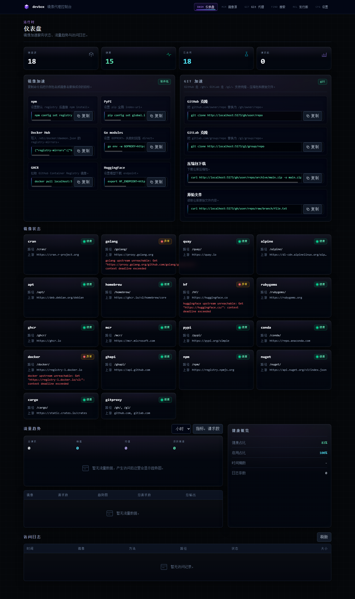

# DevBox - 自部署开发者工具箱

国内开发者自部署在 VPS 上的 Docker 容器工具，解决包管理器镜像加速和 GitHub clone 慢的核心痛点。



## 功能

| 功能 | 说明 |
|------|------|
| npm 镜像 | 代理 `https://registry.npmjs.org` |
| pip 镜像 | 代理 `https://pypi.org/simple` |
| Docker 镜像 | 代理 `https://registry-1.docker.io`（含 v2 token 认证代理） |
| GHCR 镜像 | 代理 `https://ghcr.io`（GitHub Container Registry） |
| Quay 镜像 | 代理 `https://quay.io`（Red Hat Container Registry） |
| MCR 镜像 | 代理 `https://mcr.microsoft.com`（Microsoft Container Registry） |
| Go 模块镜像 | 代理 `https://proxy.golang.org` |
| CRAN 镜像 | 代理 `https://cran.r-project.org` |
| Conda 镜像 | 代理 `https://repo.anaconda.com` |
| RubyGems 镜像 | 代理 `https://rubygems.org` |
| Cargo 镜像 | 代理 `https://static.crates.io/crates` |
| NuGet 镜像 | 代理 `https://api.nuget.org/v3/index.json` |
| APT 镜像 | 代理 `https://deb.debian.org/debian` |
| Alpine 镜像 | 代理 `https://dl-cdn.alpinelinux.org/alpine` |
| Homebrew 镜像 | 代理 `https://ghcr.io/v2/homebrew/core` |
| HuggingFace 加速 | 代理 `https://huggingface.co` 模型文件下载 |
| Git Clone 加速 | 代理 GitHub / GitLab 的 clone、archive、raw 请求 |
| GitHub API 加速 | 代理 `https://api.github.com`（解决国内 GitHub API 超时） |
| GitHub Release 下载 | 在面板持久化 Release 源，通过 DevBox 中转下载最新稳定版本中的指定资产 |
| Docker v2 Auth | Token 认证代理，让 `docker pull` 不依赖直接访问上游 |
| 镜像搜索 | Dashboard 搜索 npm、Docker Hub、PyPI、Conda、RubyGems、Cargo、NuGet 包 |
| IP 限流 | 滚动时间窗口限流防滥用，白名单免限速，黑名单直接拒绝 |
| 健康检查端点 | `/health` 端点供 Kubernetes/Docker probe 使用 |
| Prometheus 指标 | `/metrics` 端点暴露缓存命中率等指标 |
| 优雅关闭 | 收到 SIGTERM 后等待请求完成再退出 |
| Web Dashboard | 极客轻量控制台风格，提供状态总览、轻量流量趋势、访问日志、配置管理、使用指南 |
| 日志自动清除 | 流量日志保留可配置天数（默认 30 天），过期自动清理 |

## 快速部署

### Docker Compose（推荐）

1. 创建 `.env` 文件配置环境变量：

```bash
# 可选：Dashboard 鉴权密码，设置后访问 Dashboard 需登录，加速服务不受影响
AUTH_TOKEN=
# 公网访问地址（设置后 Dashboard 会显示 HTTPS 命令）
PUBLIC_URL=https://dev.example.com
# 可选：修改服务端口（默认 8080）
DEVBOX_SERVER_PORT=9090
```

2. 启动服务：

```bash
docker compose up -d
```

3. 配置 Nginx 反向代理 + SSL（端口已绑定 127.0.0.1，外部无法直接访问）：

```nginx
server {
    listen 443 ssl http2;
    server_name dev.example.com;

    ssl_certificate     /etc/letsencrypt/live/dev.example.com/fullchain.pem;
    ssl_certificate_key /etc/letsencrypt/live/dev.example.com/privkey.pem;

    location / {
        proxy_pass http://127.0.0.1:8080;
        proxy_set_header Host $host;
        proxy_set_header X-Real-IP $remote_addr;
        proxy_set_header X-Forwarded-For $proxy_add_x_forwarded_for;
        proxy_set_header X-Forwarded-Proto $scheme;
    }
}
```

### Docker Run

```bash
docker run -d \
  --name devbox \
  -p 127.0.0.1:8080:8080 \
  -v devbox-data:/data \
  -e DEVBOX_PUBLIC_URL=https://dev.example.com \
  ghcr.io/wha7ev9r/devbox:latest
```

## 配置

默认配置文件路径 `/etc/devbox/default.yaml`，可通过参数 `-c` 指定：

```bash
docker run -d -p 8080:8080 -v devbox-data:/data \
  devbox:latest -c /data/devbox.yaml
```

配置示例：

```yaml
server:
  port: 8080
  auth_token: ""                # Dashboard 鉴权 token，空则不鉴权
  public_url: ""                # 公网访问地址，如 https://dev.example.com

mirrors:
  npm:
    enabled: true
    upstream: "https://registry.npmjs.org"
    cache_ttl: "7d"
  pypi:
    enabled: true
    upstream: "https://pypi.org/simple"
    cache_ttl: "30d"
  docker:
    enabled: true
    upstream: "https://registry-1.docker.io"
    cache_ttl: "0"              # 0 = 永不过期
  golang:
    enabled: true
    upstream: "https://proxy.golang.org"
    cache_ttl: "0"
  cran:
    enabled: true
    upstream: "https://cran.r-project.org"
    cache_ttl: "30d"
  ghcr:
    enabled: true
    upstream: "https://ghcr.io"
    cache_ttl: "0"
  quay:
    enabled: true
    upstream: "https://quay.io"
    cache_ttl: "0"
  mcr:
    enabled: true
    upstream: "https://mcr.microsoft.com"
    cache_ttl: "0"
  ghapi:
    enabled: true
    upstream: "https://api.github.com"
    cache_ttl: "0"
  hf:
    enabled: true
    upstream: "https://huggingface.co"
    cache_ttl: "7d"
  conda:
    enabled: true
    upstream: "https://repo.anaconda.com"
    cache_ttl: "30d"
  rubygems:
    enabled: true
    upstream: "https://rubygems.org"
    cache_ttl: "7d"
  cargo:
    enabled: true
    upstream: "https://static.crates.io/crates"
    cache_ttl: "7d"
  nuget:
    enabled: true
    upstream: "https://api.nuget.org/v3/index.json"
    cache_ttl: "7d"
  apt:
    enabled: true
    upstream: "https://deb.debian.org/debian"
    cache_ttl: "0"
  alpine:
    enabled: true
    upstream: "https://dl-cdn.alpinelinux.org/alpine"
    cache_ttl: "0"
  homebrew:
    enabled: true
    upstream: "https://ghcr.io/v2/homebrew/core"
    cache_ttl: "0"

gitproxy:
  enabled: true
  github_upstream: "https://github.com"
  gitlab_upstream: "https://gitlab.com"
  cache_ttl: "7d"

rate_limit:
  enabled: false               # 启用 IP 限流
  rate: 500                    # 每个 IP 在滚动时间窗口内最大请求数
  interval: "3h"               # 滚动时间窗口长度（如 30m、3h、1d）
  whitelist: []                # 白名单 IP（免限速）
  blacklist: []                # 黑名单 IP（永远禁止）

cache:
  dir: "/data/cache"
  max_size: "5GB"

logging:
  level: "info"
  access_log: true
  retention_days: 30              # 流量日志保留天数
```

> 限流仅信任来自 `rate_limit.trusted_proxies` 内代理网段的 `X-Real-IP` / `X-Forwarded-For`
> （默认仅本机回环）；若端口直接暴露公网，伪造这两个头不会生效，将按真实连接 IP 限流。
> Docker 部署 + 宿主机 nginx 反代时，需把 docker 网桥网段（如 `172.16.0.0/12`）加入 `trusted_proxies`。

### 环境变量覆盖

所有配置项都可通过环境变量覆盖，格式 `DEVBOX_<层级>_<键>`：

```bash
DEVBOX_SERVER_PORT=9090
DEVBOX_AUTH_TOKEN=my-secret-token
DEVBOX_PUBLIC_URL=https://dev.example.com
DEVBOX_CACHE_DIR=/data/cache
DEVBOX_CACHE_MAX_SIZE=10GB
DEVBOX_MIRROR_NPM_UPSTREAM=https://registry.npmmirror.com
DEVBOX_MIRROR_NPM_ENABLED=false
DEVBOX_LOGGING_RETENTION_DAYS=90
DEVBOX_RATE_LIMIT_ENABLED=true
DEVBOX_RATE_LIMIT_RATE=1000
DEVBOX_RATE_LIMIT_INTERVAL=3h
```

### Web UI 鉴权

设置 `AUTH_TOKEN` 环境变量后，访问 Dashboard 需先输入密码登录：

```bash
# .env 文件中设置
AUTH_TOKEN=my-secret-password

# 然后启动
docker compose up -d
```

登录流程：
1. 浏览器访问 `https://dev.example.com`，自动跳转到登录页
2. 输入 `.env` 中设置的 `AUTH_TOKEN` 值作为密码
3. 登录成功后进入 Dashboard，右上角可点击「登出」
4. 密码即为 `AUTH_TOKEN` 的值，没有额外的用户管理系统

**注意**：鉴权仅影响 Dashboard 界面，镜像加速和 Git 代理服务不受影响，无需密码即可使用。不设置 `AUTH_TOKEN` 则 Dashboard 无需登录直接访问。

## 使用方式

### npm 镜像加速

```bash
# 临时使用
npm install express --registry http://<VPS>:8080/npm

# 永久配置
npm config set registry http://<VPS>:8080/npm
```

### pip 镜像加速

```bash
# 临时使用
pip install flask -i http://<VPS>:8080/pypi

# 永久配置
pip config set global.index-url http://<VPS>:8080/pypi
```

### Docker Hub 镜像加速

Docker Hub 使用 `registry-mirrors` 配置（Docker 原生支持）：

编辑 `/etc/docker/daemon.json`：

```json
{
  "registry-mirrors": ["https://dev.example.com/docker"]
}
```

然后重启 Docker：`systemctl restart docker`

> 注意：仅 Docker Hub 支持 `registry-mirrors`，其他 Registry 需用 `docker pull` 直接拉取。

### GHCR (GitHub Container Registry) 加速

```bash
docker pull dev.example.com/ghcr/owner/image:tag

# 例如拉取 DevBox 自身
docker pull dev.example.com/ghcr/wha7ev9r/devbox:latest
```

> 不需要加 `https://`，Docker 客户端会自动走 HTTPS。如果未配置 SSL，需加 `http://` 前缀并设置 Docker insecure registry。

### Quay (Red Hat Container Registry) 加速

```bash
docker pull dev.example.com/quay/owner/image:tag

# 例如
docker pull dev.example.com/quay/prometheus/prometheus:latest
```

### MCR (Microsoft Container Registry) 加速

```bash
docker pull dev.example.com/mcr/owner/image:tag

# 例如
docker pull dev.example.com/mcr/dotnet/sdk:8.0
```

### Docker Registry 通用说明

GHCR/Quay/MCR 的拉取原理：Docker 发送 `/v2/{registry}/...` 请求到你的域名，DevBox 根据 `{registry}` 段代理到对应上游。

如果未配置 SSL（仅 HTTP），需在 `/etc/docker/daemon.json` 中添加 insecure registry：

```json
{
  "registry-mirrors": ["https://dev.example.com/docker"],
  "insecure-registries": ["dev.example.com"]
}
```

### GitHub API 加速

```bash
# 获取仓库信息
curl http://<VPS>:8080/ghapi/repos/owner/repo

# 获取用户信息
curl http://<VPS>:8080/ghapi/users/username
```

### HuggingFace 模型加速

```bash
# 设置 HF_ENDPOINT 环境变量
export HF_ENDPOINT=http://<VPS>:8080/hf

# 然后正常使用 huggingface-cli 或 transformers
huggingface-cli download model/name
```

> 也可在 Python 中设置：`os.environ["HF_ENDPOINT"] = "http://<VPS>:8080/hf"`

### Go 模块加速

```bash
go env -w GOPROXY=http://<VPS>:8080/golang,https://proxy.golang.org,direct
```

### CRAN (R) 镜像加速

在 R 中设置：

```r
options(repos = c(CRAN = "http://<VPS>:8080/cran"))
```

### Git Clone 加速

```bash
# GitHub
git clone http://<VPS>:8080/gh/user/repo

# GitLab
git clone http://<VPS>:8080/gl/user/repo

# Archive 下载
curl http://<VPS>:8080/gh/user/repo/archive/main.zip -o main.zip

# Raw 文件
curl http://<VPS>:8080/gh/user/repo/raw/branch/file.txt
```

## Web Dashboard

Dashboard 采用极客轻量控制台风格，面向开发者高效扫读：

- Dashboard：镜像健康状态、启用统计、镜像/Git 加速用法卡片、轻量流量趋势、最近访问日志（包含镜像、Docker Registry 与 Git 代理请求）、使用命令复制
- Mirrors：镜像启停、上游地址修改、缓存 TTL 查看
- Git Proxy：GitHub / GitLab clone、archive、raw 命令生成与复制
- Search：npm、Docker Hub、PyPI 搜索与安装命令复制
- Releases：保存 GitHub Releases 地址与固定资产名，一键通过 DevBox 下载最新稳定版本中的资产
- Settings：版本/运行信息、IP 限流白名单/黑名单配置

### GitHub Release 下载

在 `Releases` 页面添加下载源，需要填写：

- 名称，例如 `March7thAssistant`
- GitHub Releases 地址，例如 `https://github.com/moesnow/March7thAssistant/releases`
- 最新稳定版本中固定的资产文件名，例如 `update.7z`

保存时 DevBox 会校验仓库与资产是否存在，之后点击 `download` 会重新确认最新稳定版本并把资产流式中转给浏览器。源保存在 `/data` 的 SQLite 数据库中，重启后仍然保留；当前仅支持公开仓库。

## 本地开发

```bash
# 前端
cd web && npm install && npm run dev

# 后端
CGO_ENABLED=0 go run ./cmd/devbox/ -c configs/devbox.yaml -f web/dist

# Docker 构建
docker build -t devbox:latest .
```

## 数据持久化

容器 `/data` 目录存储 SQLite 数据库（含 Release 下载源）和缓存文件，建议映射到 Docker volume：

```bash
docker run -d -p 8080:8080 -v devbox-data:/data devbox:latest
```

## 后续规划

- Docker Compose 模板库
- 健康监控与告警